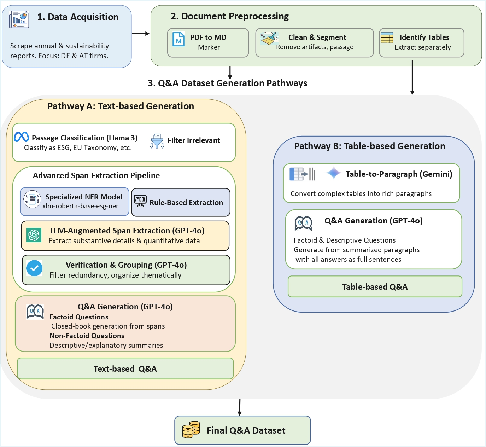

# SustainableQA: A Question Answering Dataset for Corporate Sustainability and EU Taxonomy Reporting

[](https://github.com/DataScienceUIBK/SustainableQA)
[](https://creativecommons.org/licenses/by-nc/4.0/)
[](https://www.python.org/downloads/)

## 🔄 Dataset Generation Framework Pipeline


## 📖 Overview

SustainableQA is a large-scale question-answering dataset designed for corporate sustainability reporting and EU Taxonomy compliance. The dataset provides comprehensive QA pairs extracted from corporate sustainability reports and annual reports, enabling the development of AI systems for sustainability compliance and ESG analysis.

## 🎯 Key Features

### ✨ **Comprehensive Coverage**
- **EU Taxonomy** compliance reporting
- **ESG** (Environmental, Social, Governance) metrics
- **General Sustainability** practices
- **Corporate Annual Reports** analysis

### 📊 **Large-Scale Dataset**
- **195,287** total QA pairs
- **88,792** factoid questions
- **102,539** non-factoid questions
- **3,956** table-based QA pairs
- **61** corporate reports from German and Austrian companies

### 🎨 **Question Diversity**
- **Factoid questions**: Short, precise answers (avg. 4.2 words)
- **Non-factoid questions**: Descriptive answers (avg. 32.5 words)
- **Multi-span complexity**: Questions requiring 1-10 text spans
- **Table-based queries**: Numerical and regulatory questions

## 📈 Dataset Statistics

| **Component** | **Count** | **Details** |
|---------------|-----------|-------------|
| **Total QA Pairs** | 195,287 | Factoid + Non-factoid + Tables |
| **Factoid Questions** | 88,792 | Short, precise answers |
| **Non-factoid Questions** | 102,539 | Descriptive, explanatory answers |
| **Table-based QA** | 3,956 | From 218 tables |
| **Text Passages** | 8,067 | Semantically coherent segments |
| **Source Reports** | 61 | German & Austrian companies |

### Category Distribution
| **Category** | **Passages** | **Factoid QA** | **Non-factoid QA** | **Total QA** |
|--------------|-------------|----------------|-------------------|--------------|
| **ESG** | 4,320 | 48,260 | 55,139 | 103,399 |
| **EU Taxonomy** | 747 | 8,260 | 8,906 | 17,166 |
| **Sustainability** | 3,000 | 32,272 | 38,494 | 70,746 |

### Answer Complexity Analysis
| **Category** | **Mean Spans** | **Single-Span** | **Multi-Span** | **Complexity Notes** |
|--------------|----------------|-----------------|----------------|-------------------|
| **Overall** | 1.36 | 83.3% | 16.7% | EU Taxonomy most complex |
| **ESG** | 1.37 | 83.1% | 16.9% | Moderate complexity |
| **EU Taxonomy** | 1.45 | 78.8% | **21.2%** | Highest complexity |
| **Sustainability** | 1.32 | 84.6% | 15.4% | Lowest complexity |


## 📋 Sample Questions

### Factoid Questions
```
Q: What SDGs are mentioned in the context?
A: SDG 13: Climate action, SDG 16: Peace and justice...

Q: What is the company's total CapEx for taxonomy-eligible activities?
A: €15.2 million

Q: Which environmental objectives does activity 3.10 contribute to?
A: Climate change mitigation
```

### Non-Factoid Questions
```
Q: Why does activity 3.10 fail to meet the substantial contribution criterion for the manufacture of hydrogen?
A: Because the quantified life-cycle GHG emission savings are not verified, which is necessary to fulfill the criterion for substantial contribution to climate change mitigation.

Q: How does the company assess the "Do No Significant Harm" criteria?
A: The company conducts a comprehensive evaluation across all six environmental objectives, ensuring that while contributing to one objective, the activity does not significantly harm the other five through detailed impact assessments and third-party verification.
```


## 🏛️ Ethics and Data Privacy

- **Public corporate reports** only - no confidential information
- **Regulatory compliance** focus - supporting transparency
- **No personal data** extraction or processing
- **Academic research** purpose with clear attribution
- **Open science** principles for reproducible research

## 📄 License

This dataset is released under the [Creative Commons Attribution-NonCommercial 4.0 International License (CC BY-NC 4.0)](https://creativecommons.org/licenses/by-nc/4.0/). This means you can use, share, and adapt the material for non-commercial purposes with proper attribution.

## 🔗 Links

- 💾 **Dataset**: [GitHub Repository](https://github.com/DataScienceUIBK/SustainableQA)
- 🏛️ **Institution**: [University of Innsbruck](https://www.uibk.ac.at/)
- 📧 **Contact**: [mohammed.ali@uibk.ac.at](mailto:mohammed.ali@uibk.ac.at)


---

<div align="center">

**🌟 Star this repository if you find it helpful! 🌟**

**Supporting AI Development for Sustainable Finance and Corporate Transparency**


</div>