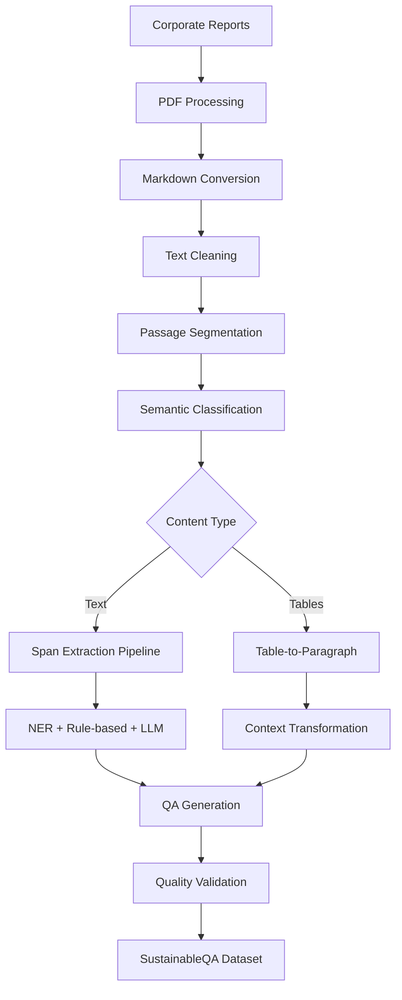

# SustainableQA: A Comprehensive Question Answering Dataset for Corporate Sustainability and EU Taxonomy Reporting

[](https://arxiv.org/abs/XXXX.XXXXX)
[](https://github.com/DataScienceUIBK/SustainableQA)
[]()
[](https://www.python.org/downloads/)

## 🔥 News
- **[2024]** SustainableQA dataset released with 195K+ QA pairs!
- **[2024]** First large-scale QA dataset for corporate sustainability reporting
- **[2024]** Paper submitted for review

## 📖 Abstract

The growing demand for corporate sustainability transparency, particularly under new regulations like the EU Taxonomy, necessitates precise data extraction from large, unstructured corporate reports. Large Language Models (LLMs) and Retrieval-Augmented Generation (RAG) systems require high-quality, domain-specific question-answering (QA) datasets to excel at particular domains. 

We introduce **SustainableQA**, a novel dataset and scalable pipeline for generating comprehensive QA datasets from corporate sustainability reports and annual reports. Our approach integrates:

- **Semantic chunk classification**
- **Hybrid span extraction pipeline** combining fine-tuned Named Entity Recognition (NER), rule-based methods, and LLM-driven refinement
- **Specialized table-to-paragraph transformation**

With over **195,000** diverse factoid and non-factoid QA pairs, SustainableQA is an effective resource for developing and benchmarking advanced knowledge assistants capable of navigating complex sustainability compliance data.

## 🎯 Key Features

### ✨ **Comprehensive Coverage**
- **EU Taxonomy** compliance reporting
- **ESG** (Environmental, Social, Governance) metrics
- **General Sustainability** practices
- **Corporate Annual Reports** analysis

### 📊 **Large-Scale Dataset**
- **195,287** total QA pairs
- **88,792** factoid questions
- **102,539** non-factoid questions
- **3,956** table-based QA pairs
- **61** corporate reports from German and Austrian companies

### 🔧 **Advanced Pipeline**
- **Multi-stage processing** with semantic classification
- **Hybrid span extraction** using NER + rule-based + LLM methods
- **Table-to-paragraph transformation** for complex tabular data
- **Two-stage LLM refinement** for quality assurance

### 🎨 **Question Diversity**
- **Factoid questions**: Short, precise answers (avg. 4.2 words)
- **Non-factoid questions**: Descriptive answers (avg. 32.5 words)
- **Multi-span complexity**: Questions requiring 1-10 text spans
- **Table-based queries**: Numerical and regulatory questions

## 📈 Dataset Statistics

| **Component** | **Count** | **Details** |
|---------------|-----------|-------------|
| **Total QA Pairs** | 195,287 | Factoid + Non-factoid + Tables |
| **Factoid Questions** | 88,792 | Short, precise answers |
| **Non-factoid Questions** | 102,539 | Descriptive, explanatory answers |
| **Table-based QA** | 3,956 | From 218 tables |
| **Text Passages** | 8,067 | Semantically coherent segments |
| **Source Reports** | 61 | German & Austrian companies |

### Category Distribution
| **Category** | **Passages** | **Factoid QA** | **Non-factoid QA** | **Total QA** |
|--------------|-------------|----------------|-------------------|--------------|
| **ESG** | 4,320 | 48,260 | 55,139 | 103,399 |
| **EU Taxonomy** | 747 | 8,260 | 8,906 | 17,166 |
| **Sustainability** | 3,000 | 32,272 | 38,494 | 70,746 |

### Answer Complexity Analysis
| **Category** | **Mean Spans** | **Single-Span** | **Multi-Span** | **Max Complexity** |
|--------------|----------------|-----------------|----------------|-------------------|
| **Overall** | 1.36 | 83.3% | 16.7% | EU Taxonomy most complex |
| **ESG** | 1.37 | 83.1% | 16.9% | Moderate complexity |
| **EU Taxonomy** | 1.45 | 78.8% | **21.2%** | Highest complexity |
| **Sustainability** | 1.32 | 84.6% | 15.4% | Lowest complexity |

## 🔄 Dataset Generation Pipeline

<div align="center">



</div>

### 🔍 **Advanced Span Extraction Pipeline**

1. **Specialized NER Model**: Fine-tuned `xlm-roberta-base-esg-ner` for ESG entity recognition
2. **Rule-based Extraction**: Regular expressions for structured data (regulations, standards, metrics)
3. **Dictionary Matching**: spaCy PhraseMatcher with comprehensive ESG/sustainability dictionaries
4. **Two-Stage LLM Refinement**:
   - **Stage 1**: LLM-augmented span extraction with GPT-4o
   - **Stage 2**: Contextual verification, filtering, and thematic organization

### 📊 **Table Processing Innovation**

- **Multi-page table handling** for complex EU Taxonomy disclosures
- **Gemini 2.5 Flash Chat** for table-to-paragraph transformation
- **Context preservation** maintaining regulatory relationships
- **Manual validation** ensuring accuracy and faithful representation

## 🏆 Benchmark Results

### Model Performance Overview
| **Model** | **Strategy** | **Factoid EM** | **Factoid F1** | **Non-factoid ROUGE-L** | **Table ROUGE-L** |
|-----------|--------------|----------------|-----------------|--------------------------|-------------------|
| **Llama 3.1 8B-FT** | **Fine-tuned** | **50.30%** | **54.28%** | **50.82%** | **70.14%** |
| GPT-4o | Zero+Context | 37.26% | 48.74% | 43.74% | 65.12% |
| Llama 3.3 70B | Zero+Context | 38.77% | 51.19% | 40.06% | 56.61% |
| Gemma3 12B | Zero+Context | 38.97% | 49.70% | 43.91% | 43.19% |
| Qwen2.5 7B | Zero+Context | 28.10% | 34.55% | 31.22% | 53.29% |

### Key Findings

🎯 **Fine-tuning Superiority**: Our fine-tuned Llama 3.1 8B outperforms much larger models including GPT-4o and Llama 3.3 70B

📈 **Context is King**: Zero-shot with context consistently outperforms both pure zero-shot and few-shot approaches

📉 **Complexity Challenge**: Performance degrades significantly with multi-span answers (74-85% degradation from 1-span to 5-span questions)

⚖️ **Quality Validation**: Human evaluation shows high ratings across all dimensions (4.0-4.2/5.0)

### Answer Complexity Impact
| **Model** | **1-Span EM** | **5-Span EM** | **Degradation** | **1-Span F1** | **5-Span F1** | **F1 Stability** |
|-----------|---------------|---------------|-----------------|---------------|---------------|------------------|
| **Llama 3.1 8B-FT** | 54.1% | 13.9% | 74.3% | 54.4% | 48.7% | 10.5% |
| **GPT-4o** | 40.6% | 9.7% | 76.1% | 48.6% | 44.0% | 9.5% |
| **Llama 3.3 70B** | 42.3% | 6.2% | 85.3% | 51.0% | 47.7% | 6.5% |

## 📋 Sample Questions

### Factoid Questions
```
Q: What SDGs are mentioned in the context?
A: SDG 13: Climate action, SDG 16: Peace and justice...

Q: What is the company's total CapEx for taxonomy-eligible activities?
A: €15.2 million

Q: Which environmental objectives does activity 3.10 contribute to?
A: Climate change mitigation
```

### Non-Factoid Questions
```
Q: Why does activity 3.10 fail to meet the substantial contribution criterion for the manufacture of hydrogen?
A: Because the quantified life-cycle GHG emission savings are not verified, which is necessary to fulfill the criterion for substantial contribution to climate change mitigation.

Q: How does the company assess the "Do No Significant Harm" criteria?
A: The company conducts a comprehensive evaluation across all six environmental objectives, ensuring that while contributing to one objective, the activity does not significantly harm the other five through detailed impact assessments and third-party verification.
```

## 🚀 Getting Started

### Quick Installation
```bash
# Clone the repository
git clone https://github.com/DataScienceUIBK/SustainableQA.git
cd SustainableQA

# Install requirements
pip install -r requirements.txt

# Download the dataset
python download_dataset.py
```

### Loading the Dataset
```python
import pandas as pd
from datasets import load_dataset

# Load from local files
factoid_data = pd.read_csv('data/factoid_qa.csv')
non_factoid_data = pd.read_csv('data/non_factoid_qa.csv')
table_data = pd.read_csv('data/table_qa.csv')

# Or load directly from HuggingFace (when available)
# dataset = load_dataset("DataScienceUIBK/SustainableQA")

# Example usage
print(f"Total QA pairs: {len(factoid_data) + len(non_factoid_data) + len(table_data)}")
print(f"Sample question: {factoid_data.iloc[0]['question']}")
print(f"Sample answer: {factoid_data.iloc[0]['answer']}")
```

### Evaluation Example
```python
from evaluation.evaluate_qa import QAEvaluator

# Initialize evaluator
evaluator = QAEvaluator()

# Evaluate your model predictions
results = evaluator.evaluate(
    predictions=your_predictions,
    ground_truth=ground_truth,
    question_type='factoid'  # or 'non_factoid', 'table'
)

print(f"Exact Match: {results['exact_match']:.2f}%")
print(f"F1 Score: {results['f1_score']:.2f}%")
```

## 📁 Dataset Structure

```
SustainableQA/
├── data/
│   ├── factoid_qa.csv           # Factoid questions and answers
│   ├── non_factoid_qa.csv       # Non-factoid questions and answers
│   ├── table_qa.csv             # Table-based questions and answers
│   ├── passages.csv             # Source text passages
│   └── metadata.csv             # Dataset metadata
├── splits/
│   ├── train.csv                # Training split (80%)
│   ├── val.csv                  # Validation split (10%)
│   └── test.csv                 # Test split (10%)
├── evaluation/
│   ├── evaluate_qa.py           # Evaluation scripts
│   └── metrics.py               # Custom metrics
├── models/
│   ├── fine_tuned_model/        # Fine-tuned Llama 3.1 8B
│   └── baseline_results.json    # Baseline model results
└── pipeline/
    ├── data_generation.py       # Dataset generation pipeline
    ├── span_extraction.py       # Span extraction methods
    └── table_processing.py      # Table-to-paragraph transformation
```

## 🔬 Applications

### 💼 **Corporate Compliance**
- **EU Taxonomy reporting** automation
- **CSRD compliance** verification
- **ESG metric extraction** for regulatory filings
- **Sustainability audit** support

### 🏦 **Financial Services**
- **Investment analysis** for sustainable funds
- **Risk assessment** for ESG factors
- **Portfolio screening** for sustainability criteria
- **Due diligence** automation

### 🤖 **AI and NLP Research**
- **Domain-specific LLM** training and evaluation
- **RAG system** development for financial documents
- **Multi-span QA** research and benchmarking
- **Information extraction** from complex documents

### 📊 **Business Intelligence**
- **Sustainability dashboard** development
- **Automated reporting** systems
- **Stakeholder communication** tools
- **Competitive analysis** for ESG performance

## 🔍 Evaluation Framework

### Metrics for Factoid Questions
- **Exact Match (EM)**: Percentage of predictions exactly matching ground truth
- **F1 Score**: Harmonic mean of precision and recall at token level
- **Precision**: Fraction of predicted tokens that are correct
- **Recall**: Fraction of ground truth tokens that are predicted

### Metrics for Non-Factoid Questions
- **ROUGE-L**: Longest Common Subsequence-based evaluation
- **METEOR**: Metric considering synonyms and paraphrases
- **BLEU**: N-gram overlap evaluation
- **BERTScore**: Semantic similarity using BERT embeddings

### Human Evaluation Dimensions
- **Question Quality** (4.2/5.0): Clarity, relevance, and linguistic quality
- **Answer Accuracy** (4.1/5.0): Factual correctness and completeness
- **Context Appropriateness** (4.0/5.0): Relevance to source passage
- **Practical Utility** (3.8/5.0): Real-world applicability

## 🆚 Comparison with Existing Datasets

| **Dataset** | **Domain** | **QA Pairs** | **Question Types** | **Languages** | **Multi-span** | **Tables** |
|-------------|------------|--------------|-------------------|---------------|----------------|------------|
| **SustainableQA** | **Sustainability** | **195,287** | **Factoid + Non-factoid** | **English** | **✓** | **✓** |
| FinQA | Finance | 8,281 | Numerical reasoning | English | ✗ | ✓ |
| ConvFinQA | Finance | 3,892 | Conversational | English | ✗ | ✓ |
| SQuAD 2.0 | General | 150,000 | Reading comprehension | English | ✗ | ✗ |
| Natural Questions | General | 307,373 | Open-domain | English | ✓ | ✗ |

## 🏛️ Ethics and Data Privacy

- **Public corporate reports** only - no confidential information
- **Regulatory compliance** focus - supporting transparency
- **No personal data** extraction or processing
- **Academic research** purpose with clear attribution
- **Open science** principles for reproducible research

## 👥 Authors

**Mohammed Ali¹** • **Abdelrahman Abdallah¹** • **Adam Jatowt¹**

¹University of Innsbruck, Innsbruck, Austria

## 📚 Citation

If you find SustainableQA useful for your research, please cite our paper:

```bibtex
@article{ali2024sustainableqa,
    title={SustainableQA: A Comprehensive Question Answering Dataset for Corporate Sustainability and EU Taxonomy Reporting},
    author={Mohammed Ali and Abdelrahman Abdallah and Adam Jatowt},
    year={2024},
    journal={arXiv preprint},
    note={First large-scale QA dataset for corporate sustainability reporting}
}
```

## 📄 License

This dataset is released under the MIT License. See [LICENSE](LICENSE) file for details.

## 🔗 Links

- 📄 **Paper**: [Coming Soon](https://arxiv.org/)
- 💾 **Dataset**: [GitHub Repository](https://github.com/DataScienceUIBK/SustainableQA)
- 🏛️ **Institution**: [University of Innsbruck](https://www.uibk.ac.at/)
- 📧 **Contact**: [mohammed.ali@uibk.ac.at](mailto:mohammed.ali@uibk.ac.at)

## 🤝 Contributing

We welcome contributions to improve SustainableQA! Please see our [Contributing Guidelines](CONTRIBUTING.md) for details.

### How to Contribute
- 🐛 **Report bugs** or suggest enhancements
- 📝 **Add new evaluation metrics** or baseline models
- 🌍 **Extend to other languages** or regulatory frameworks
- 📊 **Contribute additional corporate reports** (following privacy guidelines)

## 🆕 Future Work

- 🌍 **Multilingual expansion** to support global sustainability reporting
- 📈 **Specialized architectures** for multi-span answer extraction
- 🔗 **Integration with live data** feeds from regulatory sources
- 🤖 **Advanced RAG systems** for real-time sustainability queries

---

<div align="center">

**🌟 Star this repository if you find it helpful! 🌟**

**Advancing AI for Sustainable Finance and Corporate Transparency**


</div>