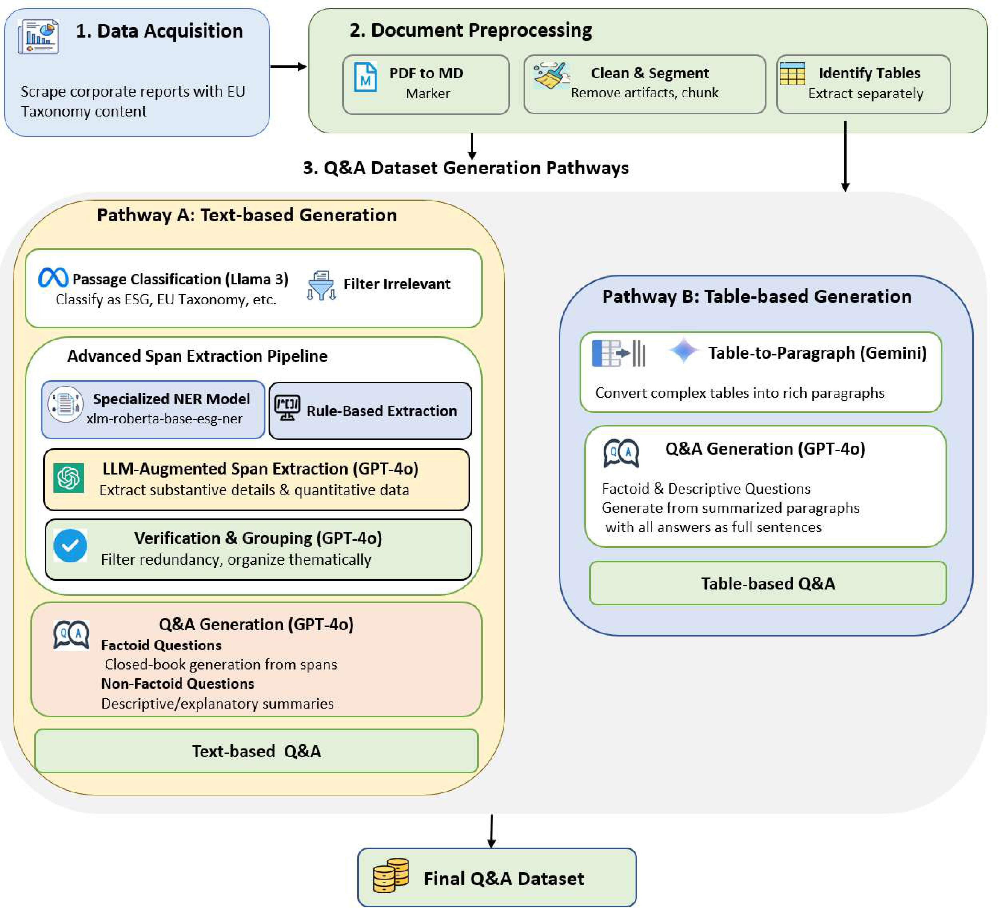

# SustainableQA: A Comprehensive Question Answering Dataset for Corporate Sustainability and EU Taxonomy Reporting

[](https://github.com/DataScienceUIBK/SustainableQA)
[](https://creativecommons.org/licenses/by-nc/4.0/)
[](https://www.python.org/downloads/)
[](https://www.uibk.ac.at/)
[](https://github.com/DataScienceUIBK/SustainableQA)

## 🔄 Dataset Generation Framework Pipeline
<div align="center">
  
</div>

## 📖 Overview

SustainableQA is a large-scale question-answering dataset designed for corporate sustainability reporting and EU Taxonomy compliance. The dataset provides comprehensive QA pairs extracted from corporate sustainability reports and annual reports, enabling the development of AI systems for sustainability compliance and ESG analysis.

## 📊 Source Data: Online Corporate Reports

Our dataset is derived from **61 publicly available corporate reports** from German and Austrian companies (2020-2024), including annual reports, sustainability reports, and EU Taxonomy disclosures downloaded from official corporate websites.

## 🎯 Key Features

- **195,287** total QA pairs from corporate sustainability reports
- **88,792** factoid questions + **102,539** non-factoid questions + **3,956** table-based QA
- **Three domains**: EU Taxonomy, ESG, and Sustainability
- **Multi-span complexity**: 16.7% of questions require multiple text spans
- **German & Austrian focus**: 61 reports from DACH region companies

## 📈 Dataset Statistics

| **Component** | **Count** | **Details** |
|---------------|-----------|-------------|
| **Total QA Pairs** | 195,287 | Factoid + Non-factoid + Tables |
| **Factoid Questions** | 88,792 | Short, precise answers |
| **Non-factoid Questions** | 102,539 | Descriptive, explanatory answers |
| **Table-based QA** | 3,956 | From 218 complex tables |
| **Text Passages** | 8,067 | Semantically coherent segments |
| **Source Reports** | 61 | German & Austrian companies |

### Category Distribution
| **Category** | **Passages** | **Factoid QA** | **Non-factoid QA** | **Total QA** |
|--------------|-------------|----------------|-------------------|--------------|
| **ESG** | 4,320 | 48,260 | 55,139 | 103,399 |
| **EU Taxonomy** | 747 | 8,260 | 8,906 | 17,166 |
| **Sustainability** | 3,000 | 32,272 | 38,494 | 70,746 |

### Answer Complexity Analysis
| **Category** | **Mean Spans** | **Single-Span** | **Multi-Span** | **Complexity Notes** |
|--------------|----------------|-----------------|----------------|-------------------|
| **Overall** | 1.36 | 83.3% | 16.7% | EU Taxonomy most complex |
| **ESG** | 1.37 | 83.1% | 16.9% | Moderate complexity |
| **EU Taxonomy** | 1.45 | 78.8% | **21.2%** | Highest complexity |
| **Sustainability** | 1.32 | 84.6% | 15.4% | Lowest complexity |


## 📋 Sample Questions

### Factoid Questions
```
Q: What SDGs are mentioned in the context?
A: SDG 13: Climate action, SDG 16: Peace and justice...

Q: What is the company's total CapEx for taxonomy-eligible activities?
A: €15.2 million

Q: Which environmental objectives does activity 3.10 contribute to?
A: Climate change mitigation
```

### Non-Factoid Questions
```
Q: Why does activity 3.10 fail to meet the substantial contribution criterion for the manufacture of hydrogen?
A: Because the quantified life-cycle GHG emission savings are not verified, which is necessary to fulfill the criterion for substantial contribution to climate change mitigation.

Q: How does the company assess the "Do No Significant Harm" criteria?
A: The company conducts a comprehensive evaluation across all six environmental objectives, ensuring that while contributing to one objective, the activity does not significantly harm the other five through detailed impact assessments and third-party verification.
```


## ⚖️ Legal & Ethical Compliance

This dataset is created for academic research at University of Innsbruck using publicly available corporate reports. All source materials were published for stakeholder transparency and regulatory compliance. The dataset is released under CC BY-NC 4.0 license for non-commercial research and educational use.


## 📚 Academic Citation

If you use this dataset in your research, please cite our work:

```bibtex
@dataset{sustainableqa2025,
  title={SustainableQA: A Comprehensive Question Answering Dataset for Corporate Sustainability and EU Taxonomy Reporting},
  author={Mohammed Ali and Abdelrahman Abdallah and Adam Jatowt},
  institution={University of Innsbruck},
  year={2025},
  url={https://github.com/DataScienceUIBK/SustainableQA},
  license={CC BY-NC 4.0}
}
```

## 📄 License

This dataset is released under the [Creative Commons Attribution-NonCommercial 4.0 International License (CC BY-NC 4.0)](https://creativecommons.org/licenses/by-nc/4.0/). This means you can use, share, and adapt the material for non-commercial purposes with proper attribution.


## 📧 Contact

- **Primary Contact**: [mohammed.ali@uibk.ac.at](mailto:mohammed.ali@uibk.ac.at)
- **Co-Authors**: [abdelrahman.abdallah@uibk.ac.at](mailto:abdelrahman.abdallah@uibk.ac.at), [adam.jatowt@uibk.ac.at](mailto:adam.jatowt@uibk.ac.at)
- **Institution**: University of Innsbruck, Department of Computer Science

## 🔗 Links

- 💾 **Dataset**: [GitHub Repository](https://github.com/DataScienceUIBK/SustainableQA)
- 🏛️ **Institution**: [University of Innsbruck](https://www.uibk.ac.at/)
- 📧 **Contact**: [mohammed.ali@uibk.ac.at](mailto:mohammed.ali@uibk.ac.at)
- 📄 **Academic Paper**: [Research Publication](https://github.com/DataScienceUIBK/SustainableQA)

---

<div align="center">

**🌟 Star this repository if you find it helpful! 🌟**

**Supporting AI Development for Sustainable Finance and Corporate Transparency**


</div>